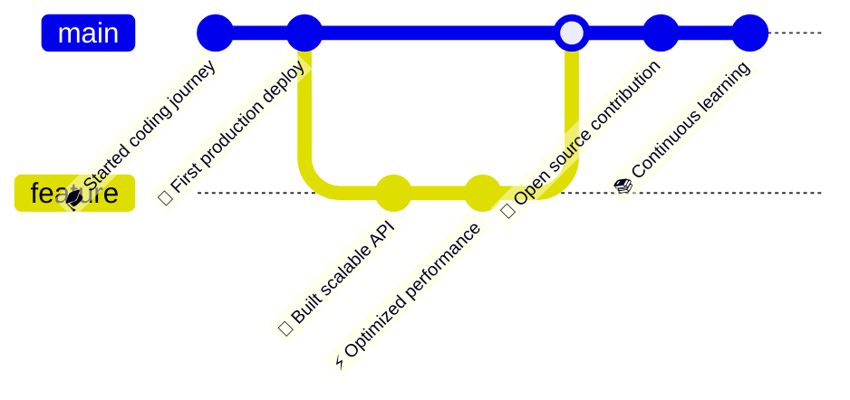

<h1 align="center">
  
</h1>

<div align="center">
  
  [+%7B+code()+%7D;sudo+rm+-rf+bugs;git+commit+-m+%22feat%3A+awesome+code%22)](https://git.io/typing-svg)

</div>

## `$ whoami`

```javascript
const developer = {
  name: "01Vortex",
  role: "Full Stack Developer",
  location: "0x1.0p+0",
  languages: ["JavaScript", "Python", "Go", "Rust"],
  architecture: ["microservices", "event-driven", "serverless"],
  currentFocus: "Building scalable systems",
  lifePhilosophy: "Code is poetry, bugs are just unexpected features"
};
```

## `$ cat skills.json`

```json
{
  "languages": {
    "expert": ["JavaScript/TypeScript", "Python", "Go"],
    "proficient": ["Rust", "Java", "C++"],
    "learning": ["Zig", "WebAssembly"]
  },
  "frontend": ["React", "Vue", "Next.js", "TailwindCSS"],
  "backend": ["Node.js", "FastAPI", "Gin", "gRPC"],
  "database": ["PostgreSQL", "MongoDB", "Redis", "Elasticsearch"],
  "devops": ["Docker", "Kubernetes", "CI/CD", "Terraform"],
  "tools": ["Git", "Vim", "tmux", "Linux"]
}
```

## `$ ls -la projects/`

```bash
drwxr-xr-x  10 vortex  staff   320B  awesome-project/
drwxr-xr-x   8 vortex  staff   256B  open-source-contrib/
drwxr-xr-x  15 vortex  staff   480B  experimental-lab/
-rw-r--r--   1 vortex  staff    42K  side-projects.tar.gz
```

## `$ git log --graph --oneline`

<div align="center">



</div>

## `$ curl -s https://api.github.com/users/01Vortex/stats`

<div align="center">


</div>

## `$ echo $SOCIAL_LINKS`

<div align="center">

[](https://github.com/01Vortex)
[](https://twitter.com/yourhandle)
[](https://linkedin.com/in/yourprofile)
[](https://yourblog.com)
[](mailto:your@email.com)

</div>

## `$ fortune | cowsay`

```
 _________________________________________
/ "Talk is cheap. Show me the code."     \
|                                         |
\ - Linus Torvalds                        /
 -----------------------------------------
        \   ^__^
         \  (oo)\_______
            (__)\       )\/\
                ||----w |
                ||     ||
```

## `$ crontab -l`

```bash
0 9 * * * cd ~/projects && git pull origin main
0 10 * * * npm run build && npm test
0 12 * * * curl -s https://api.github.com/notifications
0 18 * * * git add . && git commit -m "Daily progress"
0 22 * * * echo "Time to rest" && shutdown -h now
```


---

<div align="center">

### `$ uptime`

```
System uptime: ∞ days | Coffee consumed: ∞ cups | Bugs fixed: ∞ + 1
```

### `$ tail -f /var/log/motivation.log`

```
[INFO] Debugging is like being a detective in a crime movie where you're also the murderer
[WARN] There are only 10 types of people: those who understand binary and those who don't
[DEBUG] 99 little bugs in the code, 99 little bugs. Take one down, patch it around...
[ERROR] 127 little bugs in the code...
```


**`while(true) { code(); coffee(); repeat(); }`**

</div>

---

<div align="center">
  
</div>
